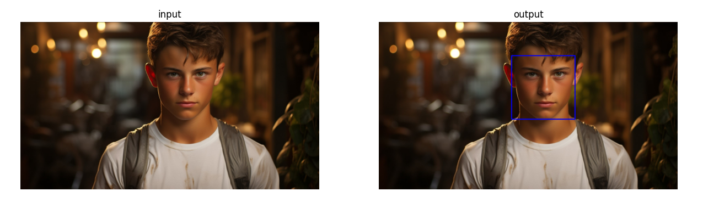
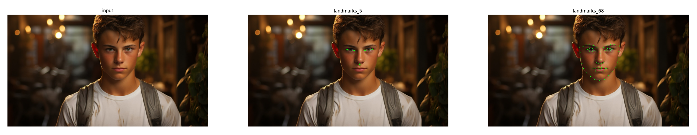

# Face Detection and Tracking Project Based on Dlib
 This is a repository based-dilb for showing simple examples of face recognition based on the Dlib library

------

​	This project contains several Python scripts focused on face detection, landmark detection, face recognition, and tracking using the `dlib` and `cv2` libraries. Below is an overview of each script and its primary functionality.

⭐ Star the repository on GitHub — it motivates me a lot!

## Scripts Overview

### 1. Face Detection

- **`face_detection/dlib_frontal_face_detector_img.py`**:
  - Detects faces in a single image using dlib's frontal face detector.
  - Displays and saves the result with detected faces outlined with rectangles.
- **`face_detection/dlib_frontal_face_detector_video.py`**:
  - Detects faces in a real-time video stream from a webcam using dlib's frontal face detector.
  - Displays the detected faces with bounding rectangles and shows the current frames per second (FPS).
- **`Haar_Cascade/CascadeClassifier_img.py`**:
  - Uses OpenCV's Haar Cascade Classifier to detect faces in an image.
  - Displays the image with detected faces outlined.



### 2. Face Landmarks Detection

- **`face_landmark_detection_img.py`**:
  - Detects facial landmarks (e.g., eyes, nose, mouth) on faces in an image using dlib's pre-trained models.
  - Displays the image with detected landmarks marked.
- **`face_landmark_detection_video.py`**:
  - Detects facial landmarks on faces in a real-time video stream using dlib's pre-trained models.
  - Displays the video feed with detected landmarks and FPS information.
- **`face_recognition.py`**:
  - Recognizes faces in an image by detecting facial landmarks.
  - Displays the image with recognized landmarks highlighted.



### 3. Face and Object Tracking

- **`face_tracking_dlib.py`**:
  - Tracks a face in real-time using dlib's correlation tracker and a webcam.
  - Displays the video feed with tracking rectangles and FPS information.
- **`face_tracking_info.py`**:
  - Similar to `face_tracking_dlib.py`, but includes additional on-screen information about tracking status.

https://private-user-images.githubusercontent.com/98147662/357582543-91b5c11e-f883-4397-848e-0427b9f6ff5d.mp4?jwt=eyJhbGciOiJIUzI1NiIsInR5cCI6IkpXVCJ9.eyJpc3MiOiJnaXRodWIuY29tIiwiYXVkIjoicmF3LmdpdGh1YnVzZXJjb250ZW50LmNvbSIsImtleSI6ImtleTUiLCJleHAiOjE3MjM1ODU4NTcsIm5iZiI6MTcyMzU4NTU1NywicGF0aCI6Ii85ODE0NzY2Mi8zNTc1ODI1NDMtOTFiNWMxMWUtZjg4My00Mzk3LTg0OGUtMDQyN2I5ZjZmZjVkLm1wND9YLUFtei1BbGdvcml0aG09QVdTNC1ITUFDLVNIQTI1NiZYLUFtei1DcmVkZW50aWFsPUFLSUFWQ09EWUxTQTUzUFFLNFpBJTJGMjAyNDA4MTMlMkZ1cy1lYXN0LTElMkZzMyUyRmF3czRfcmVxdWVzdCZYLUFtei1EYXRlPTIwMjQwODEzVDIxNDU1N1omWC1BbXotRXhwaXJlcz0zMDAmWC1BbXotU2lnbmF0dXJlPTFhZTEzYmRjOTQ1MTY3ZWM1OTcxOThlYWNkYjFlNDU4ZTVjMmRlNDI4YTQxY2Y1MWJhYjdjYzI3YzcwYTc2MTQmWC1BbXotU2lnbmVkSGVhZGVycz1ob3N0JmFjdG9yX2lkPTAma2V5X2lkPTAmcmVwb19pZD0wIn0.7_W3njxK86rhPZvE4BvgIB9mUykvTVtYwa3vytf4DkI

- **`object_tracking_dlib.py`**:
  - Provides a user-interactive tracking system where the user selects an area in a video feed to be tracked.
  - Supports starting and stopping the tracking process with keyboard inputs.

```python
Firstly, Use the mouse to draw an object detection box
Then:
'1': starting tracking, '2': stop tracking, 'Esc': exit 
```

------

## Getting Started

### Prerequisites

- Python 3
- Install required packages:

```python
dlib==19.24.2
face-recognition==1.3.0
face-recognition-models==0.3.0
opencv-python==4.8.0
```

### Models

This project utilizes several pre-trained model files, including Haar feature classifiers and Dlib's facial landmark predictors. These model files have been uploaded to [Google Drive](https://drive.google.com/file/d/1fPyoU3EdS7ci2xBwMzytriceSQRk5YCM/view?usp=drive_link) and [Baidu Cloud(extraction code: dlib)](https://pan.baidu.com/s/1EjxcCdkaZGHGCSapSC9P4Q?pwd=dlib) for users to download as needed.

### Instructions

Download and extract the model files into the `models` folder within the local project directory.

```python
models
 ├── haarcascade_eye.xml
 ├── haarcascade_eye_tree_eyeglasses.xml
	······
 ├── shape_predictor_5_face_landmarks.dat
 └── shape_predictor_68_face_landmarks.dat
```

### Running the Scripts

- To run face detection on an image:

  ```python
  python face_detection/dlib_frontal_face_detector_img.py
  ```

- To start real-time face detection using the webcam:

  ```python
  python face_detection/dlib_frontal_face_detector_video.py
  ```

- To use track function ( including face tracking and object tracking):

  ```python
  python face_tracking/face_tracking_dlib.py	# for face tracking
  python face_tracking/object_tracking_dlib.py	# for object tracking
  ```

## In the End

If you have any questions, feel free to post them in the `issues` section or contact me directly.

If this repository is useful to you, I will appreciate you will star this repository.

